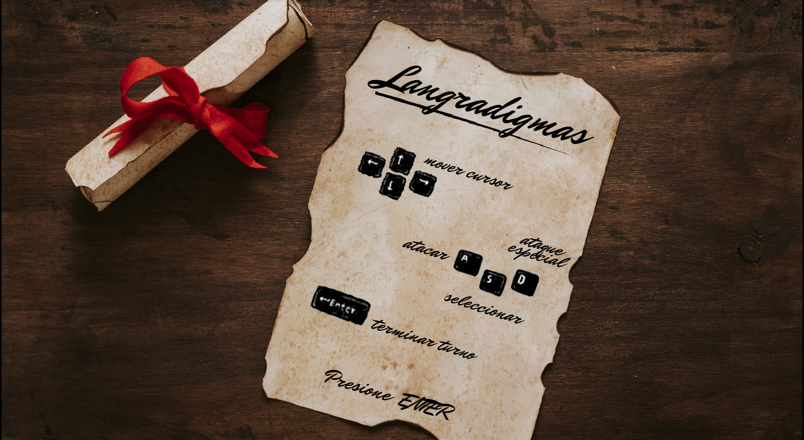

### Langradigmas

#### Grupo: AlPastoElChicken

Integrantes:

- Camila Albite
- Matias Pastori
- Nahuel Varisco
- Franco Fresno

#### Descripción e instrucciones

- El juego:
  Consiste en tres escenarios diferentes donde se enfrentarán dos tropas de 11 unidades (10 subordinados y su comandante).
  Cada tropa responde a un reino, Langradigmas y Duloc (¿quién dijo Shrek? cero imaginación, gente.)
- El objetivo:
  Eliminar al comandante rival hará que ganes el nivel.
  Se considerará ganador al jugador que vensa en dos de los tres niveles. 
- Los jugadores:
  El juego está diseñado para dos jugadores. Cada uno en control de un reino.
- Las unidades:
  Además del comandante hay tres tipos de unidades: guerrero, tirador, caballero. Los dos jugadores tienen los mismos tipos de unidades mas allá de que se vean diferentes.
- Los escenarios:
  Como se mencionó anteriormente, hay tres niveles. En el primero, el jugador 1 comandando a Langradigmas defenderá en su castillo. El segundo nivel es un enfrentamiento a campo abierto. Y en el tercero, quien tiene las bonificaciones por castillo es el jugador 2 del reino de Duloc.
- Las casillas:
  Algunas casillas otorgan bonificaciones adicionales. Ejemplos de estas son: torres, murallas, casas, árboles.
  Las casillas de río, en particular, otorgan una penalización de ataque y defensa. ¡No entres en ellas!
  Las casillas de montaña son demasiado altas, no puedes pararte encima de ellas.
- Adicionales:
  1) Aunque un jugador sea el vencedor de los dos primeros niveles se jugará el tercero. Lo diseñamos para algo, che. MÍNIMO jugalo.
  2) En cada nivel se resetean las unidades. No importan los sobrevivientes. Esto se hace para que cada nivel sea independiente del    anterior. En otro caso, se podría dar que el ganador del primer nivel tenga una ventanja adicional sobre el otro jugador y se torne irreversible. 
  3) Es obligatoria la compra de 10 unidades por nivel. Es una decisión de diseño.
